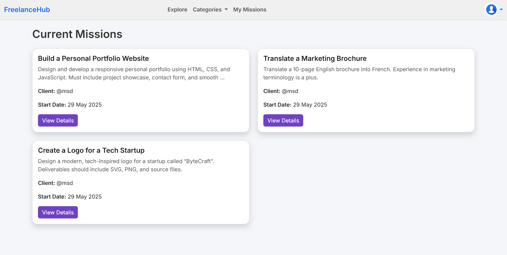
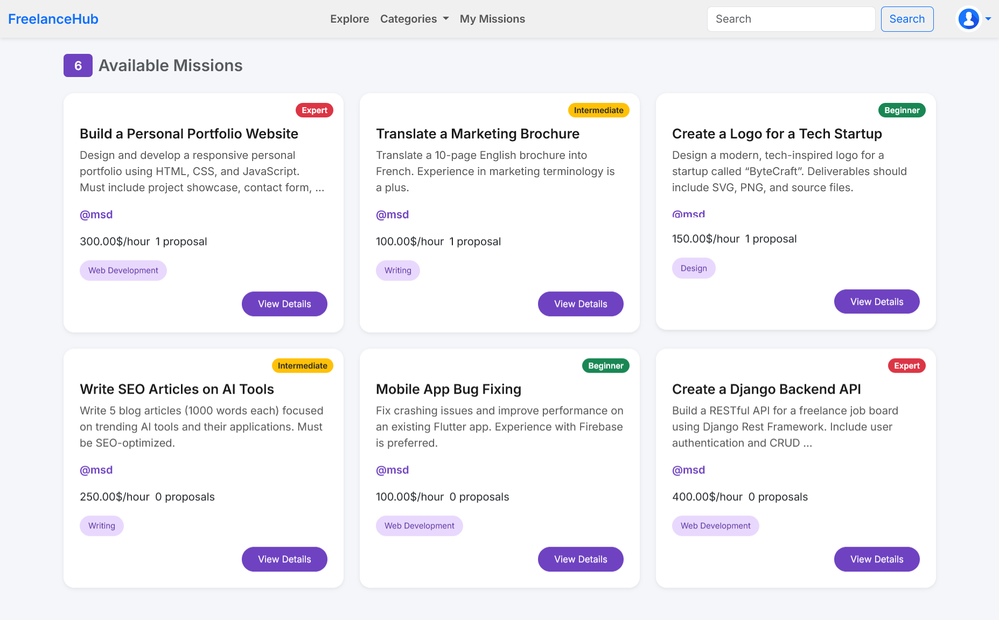
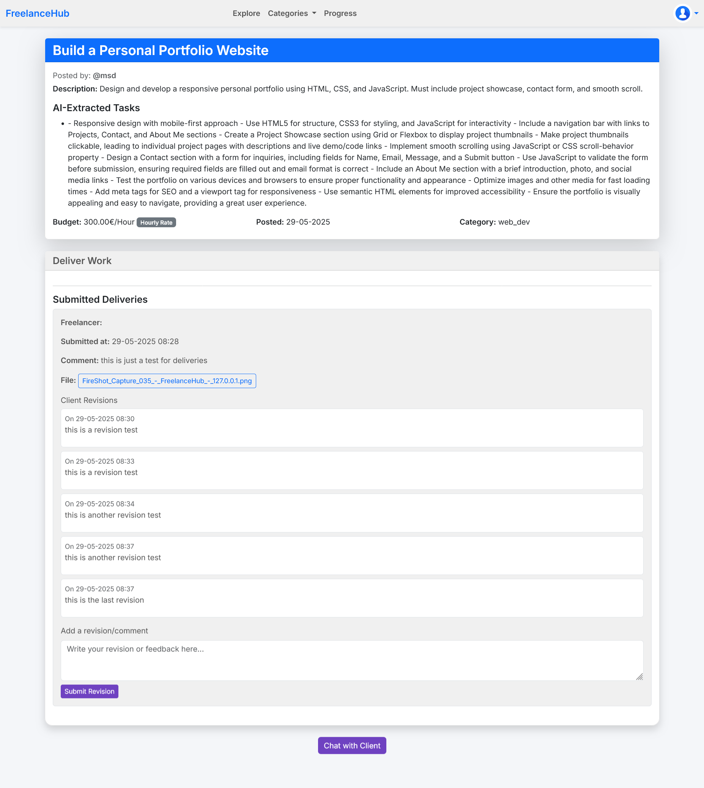

# 💼 FreelanceHub

**FreelanceHub** is a Django-based web platform designed to connect freelancers and clients in an intuitive, efficient, and smart environment. It provides features for project posting, freelancer discovery, messaging, and application tracking – all in one seamless experience.

---

## 🚀 Features

- 👤 **User Roles**: Separate dashboards for Freelancers and Clients.  
- 📄 **Project Listings**: Clients can post projects and manage applications.  
- 💬 **Real-Time Chat**: Enables secure communication between freelancers and clients.  
- 🔍 **Freelancer Discovery**: Smart filters to browse and hire based on skills, ratings, and availability.  
- 📁 **Profile Management**: Customizable profiles with portfolios, skills, and bio.  
- 📊 **Dashboard Analytics**: Overview of active projects, applications, and earnings.  
- 📎 **Media Uploads**: Freelancers can attach samples or proposals to job applications.

---

## 🛠️ Tech Stack

| Technology | Description               |
|------------|---------------------------|
| Python     | Core programming language |
| Django     | Backend web framework     |
| SQLite     | Development database      |
| HTML/CSS   | Templating and design     |
| Bootstrap  | Responsive UI framework   |
| JavaScript | Dynamic interactions      |

---

## 📁 Project Structure

```plaintext
FreelanceHub/
├── client/            # Client-side views and logic
├── freelancer/        # Freelancer-side views and logic
├── chat/              # Messaging functionality
├── templates/         # HTML templates
├── media/             # Uploaded files and assets
├── utils/             # Utility modules
├── ProjetPython/      # Shared Python logic
├── db.sqlite3         # SQLite development database
├── manage.py          # Django management script
└── .env               # Environment variables
```

---

## 🧑‍💻 Getting Started

### Prerequisites

- Python 3.10+  
- pip  
- virtualenv (recommended)  

### Installation

```bash
git clone https://github.com/ME-Massine/FreelanceHub.git
cd FreelanceHub
python -m venv venv
```
# On macOS/Linux:
```
source venv/bin/activate
```
# On Windows:
```
venv\Scripts\activate
pip install -r requirements.txt
python manage.py migrate
python manage.py runserver

```

Then open your browser and go to:  
```
http://127.0.0.1:8000/
```

---

## 📸 Screenshots

Below are some key screens from FreelanceHub:

### Current Missions


### Freelancer Dashboard


### Mission Progress


---

## 🧩 To-Do

- [ ] Add user authentication with roles  
- [ ] Enhance messaging with notifications  
- [ ] Integrate payment gateways  
- [ ] Add project recommendation engine using AI  
- [ ] Write unit and integration tests  

---

## 📜 License

This project is licensed under the **MIT License**.  
See the [LICENSE](LICENSE) file for details.

---

## 🤝 Contributing

Pull requests are welcome!  
For major changes, please open an issue first to discuss what you'd like to change.

---

## 👥 Collaborators

- [MsdAmine](https://github.com/MsdAmine)  
- [sidkizh04](https://github.com/sidkizh04)  

---

## 👨‍💻 Author

**ME Massine**  
GitHub: [@ME-Massine](https://github.com/ME-Massine)  
